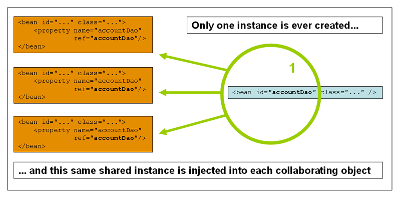

### Spring学习笔记

1、SSM：SpringMvc+Spring+Mybatis

2、Spring是一个轻量级的控制反转（IOC）和面向切面变成（AOP）的框架，支持事务的处理，支持对市面上基本所有框架的整合。

3、IOC是一种思想

* 3.1：Inverse of control中文名控制反转
* 3.2：在没有IOC这种思想之前，所有创建对象（包括对象之间的组合和依赖）的控制权都在我们程序员手中，但是这样会有一个弊端， 就是当业务发生变化时
  ``` 
  class UserService{
      private UserDao userDao = new UserDaoImpl();
  } 
  class UserService{
      private UserDao userDao = new UserDaoOracleImpl();
  }

* 3.2：我们程序员也得手动跟着业务去改变创建对象的代码，如果在多处用到，那么工作量会非常巨大。于是便有了下面一种设计思维：
  ```
  class UserService{
      private UserDao userDao = new UserDaoImpl(); 
      public void getUserDao(UserDao userDao){this.userDao = userDao;}
  }
  ```
  这样当业务变更时，我们就把控制权转交到了客户那里：

* ```userService.getUserDao(new UserDaoImpl());```

或者是

* ```userService.getUserDao(new UserDaoOracleImpl());```

这就比较符合开闭原则了，对扩展开放，对修改关闭。

4、SpringIOC：spring通过在xml文件中配置的bean，创建，管理，装配对象。 简而言之，就是把对象的控制权，转交给了spring，这样就实现了对象之间的解耦。

5、Spring入门(案例)：

```xml

<beans xmlns="http://www.springframework.org/schema/beans"
       xmlns:xsi="http://www.w3.org/2001/XMLSchema-instance"
       xsi:schemaLocation="http://www.springframework.org/schema/beans 
http://www.springframework.org/schema/beans/spring-beans.xsd">
    <bean id="user" class="demo.pojo.User">
        <property name="uName" value="李洪杰beans"/>
        <property name="age" value="24"/>
    </bean>
</beans>
```

```
    class User{
		private String uName;
		private Integer age;
		setUname/getUname.....
		setAge/getAge.......
	}
	
	ApplicationContext context = new ClasspathXmlApplicationContext("bean1.xml","bean2.xml");
	User user = (User)context.getBean("user");    //这里id/name都可以
```

6、

```xml

<beans>
    <bean id="user" class="demo.pojo.User">
        <property name="uName" value="李洪杰beans"/>
    </bean>
    <bean id="user" class="demo.pojo.User">
        <construct-arg name="uName" value="lihongjie"></construct-arg>
    </bean>
</beans>
```

区别：

* property用的是set方法，这种情况下用到的构造方法是无参构造
* <construct-arg></construct-arg>  这种方式走的是有参构造
* <construct-arg></construct-arg> 还有属性index，type，name指定参数的位置，类型以及名称，以便于能在多个重载方法中能找出想要的那个构造方法。

7、property中value和ref的区别

* value用来给基本类型赋值（包括String在内）
* ref用来给对象属性赋值

8、 Beans命名空间中的标签配置

* 8.1 <import> 导入合并其他的xml配置，若遇到重复的配置会合并  <import resource="Bean1.xml"/>
* 8.2 <bean> 把类配置在spring的xml配置文件中，把该对象的创建，使用，获取交给springIOC容器托管
* 8.3 <beans> 根标签
* 8.4 <desciption> 描述
* 8.5 <alias> 给bean起别名  <alias name="user" alias="userAlias"/>

**9、IOC本质以及和DI的关系**

* 控制反转是一种设计思想，DI（依赖注入）是实现IOC的一种方式
* 没有IOC的程序中，我们使用面向对象编程，对象的创建与对象间的依赖关系完全硬编码在程序中，对象的创建由程序自己控制， 控制反转后将对象的创建转移给第三方（这里是Spring）。
* 控制反转是一种通过描述（XML或注解）并通过第三方去生产或获取特定对象的方式。在Spring中实现控制反转的是IOC容器， 其实现方法是DI（依赖注入）

10、依赖注入DI

* 依赖：bean对象的创建依赖于容器
* 注入：bean对象中的所有属性，由容器来注入！
* 构造器注入
```xml
  <!--
  类比手动创建对象的方式
  相当于原本的： com.lihongjie.demo.User user = new com.lihongjie.demo.User("123","lihongjie","打篮球");  
  假设User的构造方法为：public User(Integer id, String uName, String hobby)
  -->
  <bean id="user" class="com.lihongjie.demo.User">
        <construct-arg index="0" value="123"></construct-arg>
        <construct-arg type="java.lang.String" value="lihongjie"></construct-arg>
        <construct-arg name="hobby" value="打篮球"></construct-arg>
  </bean>
```
* set方式注入
```xml
<beans>
  <!--*注意：没有配置construct-arg，代表此时容器是通过无参构造创建对象的-->
  <bean id="user" class="com.lihongjie.demo.User">
    <property name="id" value="123"></property>
    <property name="uName">
      <value>lihongjie</value>
    </property>
    <property name="hobby" value="打篮球"></property>
  </bean>
  
  <!--附：各种属性的注入方式（构造器注入和set注入都适用）-->
  <!-- User对象属性
        private String name;
        private Address address;
        private String[] books;
        private List<Hobby> hobbys;
        private Map<String, String> card;
        private Set<String> games;
        private String wife;
        private Properties info;
  -->
  <bean class="pojo.Student" id="student" name="student">
    <property name="name">
      <value>差不多先生</value>
    </property>
    
    <property name="address" ref="address"></property>
    
    <property name="books">
      <list>
        <value>红楼梦</value>
        <value>西游记</value>
        <value>三国演义</value>
        <value>水浒传</value>
        <value></value>
      </list>
    </property>
    
    <property name="hobbys">
      <list>
        <ref bean="hobby"/>
        <ref bean="hobby"/>
      </list>
    </property>
    
    <property name="card">
      <map>
        <entry key="食堂卡" value="食堂卡001"></entry>
        <entry key="爱好卡" value="爱好卡001"></entry>
      </map>
    </property>
    
    <property name="games">
      <set>
        <value>LOL</value>
        <value>部落冲突</value>
      </set>
    </property>
    
    <property name="wife">
      <null/>
    </property>
    
    <property name="info">
      <props>
        <prop key="driver">com.mysql.jdbc.Driver</prop>
        <prop key="url">jdbc:mysql://localhost:3306/learnSpring</prop>
        <prop key="user">root</prop>
        <prop key="password">123456</prop>
      </props>
    </property>
    
  </bean>

  <bean class="pojo.Address" id="addressId"  name="address">
    <constructor-arg value="123456"></constructor-arg>
    <property name="addName" value="远光软件1"></property>
  </bean>

  <!--通过有参构造方法+set方法实例化对象;容器中的name和id不能冲突，否则会启动报错-->
  <!--<bean class="pojo.Address" name="address">
      <constructor-arg value="456789"></constructor-arg>
      <property name="addName" value="远光软件2"></property>
  </bean>-->

  <bean class="pojo.Hobby" id="hobby">
    <property name="hobbyId" value=""></property>
    <property name="hobbyName" value="打篮球"></property>
  </bean>
  
</beans>
```
* 扩展注入 【参见demo：spring-ioc-06】
  * p命名空间
  * c命名空间
```xml
<beans xmlns="http://www.springframework.org/schema/beans"
       xmlns:xsi="http://www.w3.org/2001/XMLSchema-instance"
       xmlns:p="http://www.springframework.org/schema/p"
       xmlns:c="http://www.springframework.org/schema/c"
       xsi:schemaLocation="http://www.springframework.org/schema/beans
       http://www.springframework.org/schema/beans/spring-beans.xsd">
    <!--如果直接写p:address="address"，则会把"address"当成一个字符串而不是一个对象-->
    <bean class="com.demo.pojo.User" name="user" p:uId="123" p:uName="lihongjie" p:address-ref="address"></bean>

    <!--
        c: addrNoTemp（addrNoTemp必须和构造方法对应的参数名称保持一致），走的是构造器注入
        p: addNameTemp（【setAddNameTemp，大小写必须保持一致，必须按照标准驼峰】这个方法必须要存在，否则会报错），走的是set注入
    -->
    <bean class="com.demo.pojo.Address" id="address" c:addrNoTemp="456789" p:addNameTemp="远光软件"></bean>
</beans>
```  
11、Bean Scopes（每一个在xml中定义的<bean></bean>的范围） 【参见demo：spring-ioc-06】

  * singleton：单例，每一个xml定义的bean对应的类在IOC容器中只有一个实例【默认】 
    
  * prototype：原型，每一个xml定义的bean对应的类在IOC容器中有多个实例
    * 注意：数据访问层dao通常被定义为单例的，因为他并不保存任何的会话状态
    
  * 只有在web环境下的ApplicationContext才可用：
    * request： 一次请求一个对象，对象生命周期为：请求
    * session： 一个HTTP Session一个对象，对象生命周期为：session
    * application：一个ServletContext一个对象，对象生命周期为：ServletContext
    * websocket：一个websocket一个对象，对象生命周期为：websocket
  * 注意：singleton和prototype
```xml
  <beans xmlns="http://www.springframework.org/schema/beans"
         xmlns:xsi="http://www.w3.org/2001/XMLSchema-instance"
         xsi:schemaLocation="http://www.springframework.org/schema/beans
       http://www.springframework.org/schema/beans/spring-beans.xsd">
        <!--
            上面说的Bean Scope说的是Scope是针对每一个定义的bean而言,
            这种定义的方式获取到的hobby1和hobby2不是同一个，因为哪怕他们的类型相同，
            但是scope针对的是每一个bean标签（定义），区别于传统中代码书写的单例模式。
            表达的意思：hobby1在IOC容器中只有一个实例，hobby2在IOC容器中只有一个实例，且两者的那个实例不同。
        -->
        <bean class="pojo.Hobby" id="hobby1" scope="singleton"></bean>
        <bean class="pojo.Hobby" id="hobby2" scope="singleton"></bean>
        
  </beans>
```
12、Bean的自动装配(参见demo：spring-ioc-07)
1. 自动装配是Spring满足bean依赖的一种方式。
2. Spring会在上下文中自动寻找，并自动给bean装配属性。
3. 在Spring中有三种装配的方式
    * 在xml中显示的配置（构造器注入&set注入之类的）
    * 在java中显示的配置
    * 隐式的自动装配bean【重要】
4. 隐式的自动装配bean
    1. 非注解模式(bean标签上配置autowire)
        * byName: 会自动在容器上下文中查找，和自己对象set方法后面的值对应的bean的id/name
          （如属性名：catPet 方法名：setCatPet-》会去容器中找id/name为catPet【其实就是去掉set然后后面那截首字母小写】的bean）
          如果找不到，则注入失败该值为null，通过set方式注入。如果set方法书写不规范可能会导致注入失败。
        * byType: 会自动在容器上下文中查找，和自己对象属性类型相同的beanid/name。如果找到有多个相同类型的bean
          则会报错。通过set方式注入。
        * constructor: 和byType一样，通过类型查找注入。（需要有对应的构造方法），如果找到有多个相同类型的bean仍然可以注入成功。
        * no: 默认值，不进行自动注入。
        * 当设置为byName或byType时，即使beans.xml文件中配置了，对需要注入对象中的String或者基本类型的属性对应的bean定义，
          但是仍然不会对这两大类进行注入。但是构造器可以对String类型进行注入。
        * 当byType自动注入时，如果含有多个相同类型的bean定义(正常会报错)，可以使用设置autowire-candidate=false，
          排除不想注入的那些同类型bean【autowire-candidate只对byType生效】
    ```xml
    <bean id="human" class="com.demo.pojo.noanotation.Human" autowire="xxx"/>
    ```
    
    ```xml
    
    <beans>
        <bean id="catPet" class="com.demo.pojo.noanotation.Cat"></bean>
        <!--当存在多个类型时byType会报错-->
        <bean id="catPet2" class="com.demo.pojo.noanotation.Cat"></bean>
        <bean id="dog" class="com.demo.pojo.noanotation.Dog"></bean>
        <!--注意：当配置为byName或者byType的时候，spring应该设置了基本类型和String类型的过滤，并不会对这两类类型进行注入-->
        <bean id="name" class="java.lang.String">
            <constructor-arg name="original" value=""></constructor-arg>
        </bean>
     
        <!--使用自动注入，非注解版byName,走的set方法注入-->
        <bean id="humanAutowiredByName" class="com.demo.pojo.noanotation.Human" autowire="byName"></bean>
        <!--使用自动注入，byType，走的set方法注入-->
        <!--<bean id="humanAutowiredByType" class="com.demo.pojo.noanotation.Human" autowire="byType"></bean>-->
    
        <bean id="humanAutowiredDefault" class="com.demo.pojo.noanotation.Human" autowire="default"></bean>
    
        <bean id="humanAutowiredConstruct" class="com.demo.pojo.noanotation.Human" autowire="constructor"></bean>
    </beans>
      ```
* 注解模式
    1. 使用注解进行自动注入的步骤：
        * 导入约束：context约束
        * 在beans.xml文件中配置注解的支持，配置了之后Spring会帮我们隐式注册一些后处理器【参见Spring官网】
          （AutowiredAnnotationBeanPostProcessor....）
          ```
          <context:annotation-config/>
          ```
        * 在需要自动装配的类的属性/对应set方法/构造方法上加自动注入注解（@Autowired、@Resource等）
        
    2. @Autowired
        * 作用：自动装配属性，其中的require属性默认为true【为true时，总而言之要确定唯一的一个bean，否则会抛错。为false时，
          若确定不了唯一的bean或者找不到满足的bean则会注入为null】
          
        * 注意：其实String类型和基本数据类型（通过基本类型对应的封装类）也都是可以自动注入的，但是直接通过property/constructor-arg注入即可，
          自动注入没什么意义。
          ```xml
          <!--将String类型的name注入到容器中，不建议！！！-->
          <bean id="name" class="java.lang.String"/>
          ```
          
        * 加在需要注入的类属性上
            * @Autowired是通过类型去进行自动注入的，会去SpringIOC容器中寻找与需要注入对象的属性类型相同的bean，
            但是如果在容器中找不到相同类型的bean，会抛出异常org.springframework.beans.factory.UnsatisfiedDependencyException，
            
            * @Autowired会先通过类型（如果类型不存在，且require=true，会直接抛异常），（有多个类型相同的bean定义的时候）然后再通过属性名字去容器中找，
            如果通过类型找找到多个，但是再根据属性名字找，这多个bean的id/name都和属性名不一样则会抛异常【总而言之要确定唯一的一个bean】。
            可以搭配@Qualifier("catPet")，指定特定名字的bean（前提仍然是：IOC容器中必须存在相同类型的bean）。
            
            * @Autowired直接加在属性上，不通过set也不通过构造方法进行注入,直接通过反射field.setValue()
        
        * 加在需要注入属性的set方法上：
          
            * 通过set方法进行自动注入，如果找到有多个类型相同的bean，则根据形参的名字去匹配
              
            * @Autowired(required=false) 默认为true，若为true，找不到可以注入的bean则抛错。若为false，注入为null程序不抛错。
              
            * @Nullable 标签加在属性或方法的形参上面，允许属性或方法上的形参为空。配合@Autowired标签使用<==> @Autowired(required=false)
        
        *  加在构造方法上
           
            * 通过对应的有参构造方法进行注入，会对构造方法中的所有形式参数进行注入。只要有一个形式参数，在IOC容器中找不到对应id/name的对象实例，
              
            * 则会注入失败。（required=false,则所有值为null。若为true，则直接抛错）
        ```
        @Autowired(required = false)
        @Qualifier("catPet")
        private Cat catPet2;  
       
        @Autowired
        public void setCatPet111(@Nullable Cat catPet) {
            System.out.println("测试@autowire标签，经过setCatPet方法.....");
            this.catPet = catPet;
        }
       
        @Autowired(required = false)
        public HumanByConstructor(Cat catPet, Dog dog, String name, Integer id) {
            System.out.println("测试@autowire标签，进入有参构造方法.....");
            this.catPet = catPet;
            this.dog = dog;
            this.name = name;
            this.id = id;
        }
        ``` 
       
    3. @Resource标签（这里只讨论标签加在属性上）
        * 先根据属性名字去IOC容器里找对应id/name相同的bean，若找不到则再根据类型去找（如果此时再找到多个满足条件的bean则会报错，
          需要指定唯一匹配的bean才能自动装配成功）
          
        * 通过name属性指定，将IOC容器中的对应id/name的bean注入。
        ```
            @Resource(name = "catPet2")
            private Cat catPet3;
        ```
       

        
    
