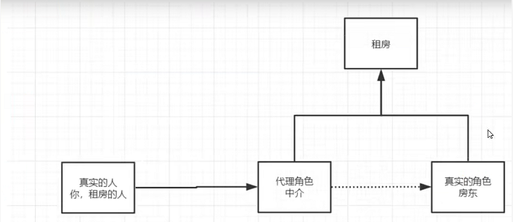
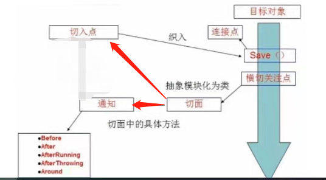

### Spring学习笔记

#### SpringIOC以及注解学习

##### 1、SSM：SpringMvc+Spring+Mybatis

##### 2、Spring是一个轻量级的控制反转（IOC）和面向切面变成（AOP）的框架，支持事务的处理，支持对市面上基本所有框架的整合。

##### 3、IOC是一种思想

* 3.1：Inverse of control中文名控制反转
* 3.2：在没有IOC这种思想之前，所有创建对象（包括对象之间的组合和依赖）的控制权都在我们程序员手中，但是这样会有一个弊端， 就是当业务发生变化时

  ```
  class UserService{
      private UserDao userDao = new UserDaoImpl();
  } 
  class UserService{
      private UserDao userDao = new UserDaoOracleImpl();
  }

  ```
* 3.2：我们程序员也得手动跟着业务去改变创建对象的代码，如果在多处用到，那么工作量会非常巨大。于是便有了下面一种设计思维：

  ```
  class UserService{
      private UserDao userDao; 
      public void getUserDao(UserDao userDao){this.userDao = userDao;}
  }
  ```

  这样当业务变更时，我们就把控制权转交到了客户那里：
* ```userService.getUserDao(new UserDaoImpl());```

或者是

* ```userService.getUserDao(new UserDaoOracleImpl());```

这就比较符合开闭原则了，对扩展开放，对修改关闭。

##### 4、SpringIOC：spring通过在xml文件中配置的bean，创建，管理，装配对象。 简而言之，就是把对象的控制权，转交给了spring，这样就实现了对象之间的解耦。

##### 5、Spring入门(案例)：

```xml

<beans xmlns="http://www.springframework.org/schema/beans"
       xmlns:xsi="http://www.w3.org/2001/XMLSchema-instance"
       xsi:schemaLocation="http://www.springframework.org/schema/beans 
http://www.springframework.org/schema/beans/spring-beans.xsd">
    <bean id="user" class="demo.pojo.User">
        <property name="uName" value="李洪杰beans"/>
        <property name="age" value="24"/>
    </bean>
</beans>
```

```
    class User{
		private String uName;
		private Integer age;
		setUname/getUname.....
		setAge/getAge.......
	}

	ApplicationContext context = new ClasspathXmlApplicationContext("bean1.xml","bean2.xml");
	User user = (User)context.getBean("user");    //这里id/name都可以
```

##### 6、property和construct-arg的区别

```xml

<beans>
    <bean id="user" class="demo.pojo.User">
        <property name="uName" value="李洪杰beans"/>
    </bean>
    <bean id="user" class="demo.pojo.User">
        <construct-arg name="uName" value="lihongjie"></construct-arg>
    </bean>
</beans>
```

区别：

* property用的是set方法，这种情况下用到的构造方法是无参构造
* <construct-arg></construct-arg>  这种方式走的是有参构造
* <construct-arg></construct-arg> 还有属性index，type，name指定参数的位置，类型以及名称，以便于能在多个重载方法中能找出想要的那个构造方法。

##### 7、property中value和ref的区别

* value用来给基本类型赋值（包括String在内）
* ref用来给属性中的引用类型赋值

##### 8、 Beans命名空间中的标签配置【参见spring-ioc-04】

* 8.1 import标签作用是：导入合并其他的xml配置，若遇到重复的配置会合并  <import resource="Bean1.xml"/>
    * 关于配置文件中bean的id/name以及别名【注意】：

        * 如果不同配置文件中的bean的id/name相同，那么后面配置的将会覆盖前面配置的(跟代码执行顺序一样，从上至下)
        * 在同一个配置文件中不同的bean的id/name不允许重复，否则会报错，但是用alias起的别名可以达到覆盖的效果

      ```
      <!-- 经测试用name给bean起别名，功能更加强大，且别名之间可以重复，若重复则会被覆盖-->
      <bean id="userBm" class="demo.pojo.User" name="u1;u2 u3,u4,userAlias">
          <property name="uName" value="测试别名"/>
      </bean>
  
      <!--alias标签不支持该写法-->
      <!--<alias name="user" alias="userAlias,u1;u2 u3"/>-->
      <alias name="user" alias="userAlias"/>
      ```

        * 用bean的name属性起别名支持英文逗号（,），英文空格（ ），以及英文分号（;）分隔，若同一个bean中的name属性重复，也不会报错。

      ```
      <bean id="userBm" class="demo.pojo.User" name="u1;u2 u3,u4,userAlias u1">
          <property name="uName" value="测试别名"/>
      </bean>
      ```
* 8.2 bean标签作用是：把类配置在spring的xml配置文件中，把该对象的创建，获取使用交给springIOC容器托管
* 8.3 beans标签作用是：根标签
* 8.4 desciption标签作用是：描述
* 8.5 alias标签作用是：给bean起别名
  ```
   <!--alias标签不支持该写法-->
   <!--<alias name="user" alias="userAlias,u1;u2 u3"/>-->
   <alias name="user" alias="userAlias"/>
  ```

##### **9、IOC本质以及和DI的关系**

* 控制反转是一种设计思想，DI（依赖注入）是实现IOC的一种方式
* 没有IOC的程序中，我们使用面向对象编程，对象的创建与对象间的依赖关系完全硬编码在程序中，对象的创建由程序自己控制， 控制反转后将对象的创建转移给第三方（这里是Spring）。
* 控制反转是一种通过描述（XML或注解）并通过第三方去生产或获取特定对象的方式。在Spring中实现控制反转的是IOC容器， 其实现方法是DI（依赖注入）

##### 10、依赖注入DI

* 依赖：bean对象的创建依赖于容器
* 注入：bean对象中的所有属性，由容器来注入！
* 构造器注入

```xml
  <!--
  类比手动创建对象的方式
  相当于原本的： com.lihongjie.demo.User user = new com.lihongjie.demo.User("123","lihongjie","打篮球");  
  假设User的构造方法为：public User(Integer id, String uName, String hobby)
  -->
<bean id="user" class="com.lihongjie.demo3.User">
    <construct-arg index="0" value="123"></construct-arg>
    <construct-arg type="java.lang.String" value="lihongjie"></construct-arg>
    <construct-arg name="hobby" value="打篮球"></construct-arg>
</bean>
```

* set方式注入

```xml

<beans>
    <!--*注意：没有配置construct-arg，代表此时容器是通过无参构造创建对象的-->
    <bean id="user" class="com.lihongjie.demo3.User">
        <property name="id" value="123"></property>
        <property name="uName">
            <value>lihongjie</value>
        </property>
        <property name="hobby" value="打篮球"></property>
    </bean>

    <!--附：各种属性的注入方式（构造器注入和set注入都适用）-->
    <!-- User对象属性
          private String name;
          private Address address;
          private String[] books;
          private List<Hobby> hobbys;
          private Map<String, String> card;
          private Set<String> games;
          private String wife;
          private Properties info;
    -->
    <bean class="pojo.Student" id="student" name="student">
        <property name="name">
            <value>差不多先生</value>
        </property>

        <property name="address" ref="address"></property>

        <property name="books">
            <list>
                <value>红楼梦</value>
                <value>西游记</value>
                <value>三国演义</value>
                <value>水浒传</value>
                <value></value>
            </list>
        </property>

        <property name="hobbys">
            <list>
                <ref bean="hobby"/>
                <ref bean="hobby"/>
            </list>
        </property>

        <property name="card">
            <map>
                <entry key="食堂卡" value="食堂卡001"></entry>
                <entry key="爱好卡" value="爱好卡001"></entry>
            </map>
        </property>

        <property name="games">
            <set>
                <value>LOL</value>
                <value>部落冲突</value>
            </set>
        </property>

        <property name="wife">
            <null/>
        </property>

        <property name="info">
            <props>
                <prop key="driver">com.mysql.jdbc.Driver</prop>
                <prop key="url">jdbc:mysql://localhost:3306/learnSpring</prop>
                <prop key="user">root</prop>
                <prop key="password">123456</prop>
            </props>
        </property>

    </bean>

    <bean class="pojo.Address" id="addressId" name="address">
        <constructor-arg value="123456"></constructor-arg>
        <property name="addName" value="远光软件1"></property>
    </bean>

    <!--通过有参构造方法+set方法实例化对象;容器中的name和id不能冲突，否则会启动报错-->
    <!--<bean class="pojo.Address" name="address">
        <constructor-arg value="456789"></constructor-arg>
        <property name="addName" value="远光软件2"></property>
    </bean>-->

    <bean class="pojo.Hobby" id="hobby">
        <property name="hobbyId" value=""></property>
        <property name="hobbyName" value="打篮球"></property>
    </bean>

</beans>
```

* 扩展注入 【参见demo：spring-ioc-06】
    * p命名空间
    * c命名空间

```xml

<beans xmlns="http://www.springframework.org/schema/beans"
       xmlns:xsi="http://www.w3.org/2001/XMLSchema-instance"
       xmlns:p="http://www.springframework.org/schema/p"
       xmlns:c="http://www.springframework.org/schema/c"
       xsi:schemaLocation="http://www.springframework.org/schema/beans
       http://www.springframework.org/schema/beans/spring-beans.xsd">
    <!--如果直接写p:address="address"，则会把"address"当成一个字符串而不是一个对象-->
    <bean class="com.demo.pojo.User" name="user" p:uId="123" p:uName="lihongjie" p:address-ref="address"></bean>

    <!--
        c: addrNoTemp（addrNoTemp必须和构造方法对应的参数名称保持一致），走的是构造器注入
        p: addNameTemp（【setAddNameTemp，大小写必须保持一致，必须按照标准驼峰】这个方法必须要存在，否则会报错），走的是set注入
    -->
    <bean class="com.demo.pojo.Address" id="address" c:addrNoTemp="456789" p:addNameTemp="远光软件"></bean>
</beans>
```

##### 11、Bean Scopes（每一个在xml中定义的<bean></bean>的范围） 【参见demo：spring-ioc-06】


* singleton：单例，每一个xml定义的bean对应的类在IOC容器中只有一个实例【默认】
  
* prototype：原型，每一个xml定义的bean对应的类在IOC容器中有多个实例
    * 注意：数据访问层dao通常被定义为单例的，因为他并不保存任何的会话状态

      
* 只有在web环境下的ApplicationContext才可用：
    * request： 一次请求一个对象，对象生命周期为：请求
    * session： 一个HTTP Session一个对象，对象生命周期为：session
    * application：一个ServletContext一个对象，对象生命周期为：ServletContext
    * websocket：一个websocket一个对象，对象生命周期为：websocket
* 注意：singleton和prototype

```xml

<beans xmlns="http://www.springframework.org/schema/beans"
       xmlns:xsi="http://www.w3.org/2001/XMLSchema-instance"
       xsi:schemaLocation="http://www.springframework.org/schema/beans
       http://www.springframework.org/schema/beans/spring-beans.xsd">
    <!--
        上面说的Bean Scope说的是Scope是针对每一个定义的bean而言,
        这种定义的方式获取到的hobby1和hobby2不是同一个，因为哪怕他们的类型相同，
        但是scope针对的是每一个bean标签（定义），区别于传统中代码书写的单例模式。
        表达的意思：hobby1在IOC容器中只有一个实例，hobby2在IOC容器中只有一个实例，且两者的那个实例不同。
    -->
    <bean class="pojo.Hobby" id="hobby1" scope="singleton"></bean>
    <bean class="pojo.Hobby" id="hobby2" scope="singleton"></bean>

</beans>
```

##### 12、Bean的自动装配(参见demo：spring-ioc-07)

1. 自动装配是Spring满足bean依赖的一种方式。
2. Spring会在上下文中自动寻找，并自动给bean装配属性。
3. 在Spring中有三种装配的方式

    * 在xml中显示的配置（构造器注入&set注入之类的）
    * 在java中显示的配置
    * 隐式的自动装配bean【重要】
4. 隐式的自动装配bean

    1. 非注解模式(bean标签上配置autowire)
        * byName: 会自动在容器上下文中查找，和自己对象set方法后面的值对应的bean的id/name （如属性名：catPet
          方法名：setCatPet-》会去容器中找id/name为catPet【其实就是去掉set然后后面那截首字母小写】的bean）
          如果找不到，则注入失败该值为null，通过set方式注入。如果set方法书写不规范可能会导致注入失败。
        * byType: 会自动在容器上下文中查找，和自己对象属性类型相同的beanid/name。如果找到有多个相同类型的bean 则会报错。通过set方式注入。
        * constructor: 和byType一样，通过类型查找注入。（需要有对应的构造方法），如果找到有多个相同类型的bean仍然可以注入成功。
        * no: 默认值，不进行自动注入。
        * 当设置为byName或byType时，即使beans.xml文件中配置了，对需要注入对象中的String或者基本类型的属性对应的bean定义， 但是仍然不会对这两大类进行注入。但是构造器可以对String类型进行注入。
        * 当byType自动注入时，如果含有多个相同类型的bean定义(正常会报错)，可以使用设置autowire-candidate=false，
          排除不想注入的那些同类型bean【autowire-candidate只对byType生效】

   ```xml
   <bean id="human" class="com.demo1.pojo.noanotation.Human" autowire="xxx"/>
   ```

   

   ```xml

   <beans>
       <bean id="catPet" class="com.demo1.pojo.noanotation.Cat"></bean>
       <!--当存在多个类型时byType会报错-->
       <bean id="catPet2" class="com.demo1.pojo.noanotation.Cat"></bean>
       <bean id="dog" class="com.demo1.pojo.noanotation.Dog"></bean>
       <!--注意：当配置为byName或者byType的时候，spring应该设置了基本类型和String类型的过滤，并不会对这两类类型进行注入-->
       <bean id="name" class="java.lang.String">
           <constructor-arg name="original" value=""></constructor-arg>
       </bean>

       <!--使用自动注入，非注解版byName,走的set方法注入-->
       <bean id="humanAutowiredByName" class="com.demo1.pojo.noanotation.Human" autowire="byName"></bean>
       <!--使用自动注入，byType，走的set方法注入-->
       <!--<bean id="humanAutowiredByType" class="com.demo.pojo.noanotation.Human" autowire="byType"></bean>-->

       <bean id="humanAutowiredDefault" class="com.demo1.pojo.noanotation.Human" autowire="default"></bean>

       <bean id="humanAutowiredConstruct" class="com.demo1.pojo.noanotation.Human" autowire="constructor"></bean>
   </beans>
   ```

* 注解模式
    1. 使用注解进行自动注入的步骤：

        * 导入约束：context约束
        * 在beans.xml文件中配置注解的支持，配置了之后Spring会帮我们隐式注册一些后处理器【参见Spring官网】 （AutowiredAnnotationBeanPostProcessor....）
          ```
          <context:annotation-config/>
          ```
        * 在需要自动装配的类的属性/对应set方法/构造方法上加自动注入注解（@Autowired、@Resource等）
    2. @Autowired

        * 作用：自动装配属性，其中的require属性默认为true【为true时，总而言之要确定唯一的一个bean，否则会抛错。为false时， 若确定不了唯一的bean或者找不到满足的bean则会注入为null】
        * 注意：其实String类型和基本数据类型（通过基本类型对应的封装类）也都是可以自动注入的，但是直接通过property/constructor-arg注入即可， 自动注入没什么意义。

          ```xml
          <!--将String类型的name注入到容器中，不建议！！！-->
          <bean id="name" class="java.lang.String"/>
          ```
        * 加在需要注入的类属性上

            * @Autowired是通过类型去进行自动注入的，会去SpringIOC容器中寻找与需要注入对象的属性类型相同的bean，
              但是如果在容器中找不到相同类型的bean，会抛出异常org.springframework.beans.factory.UnsatisfiedDependencyException，
            * @Autowired会先通过类型（如果类型不存在，且require=true，会直接抛异常），（有多个类型相同的bean定义的时候）然后再通过属性名字去容器中找，
              如果通过类型找找到多个，但是再根据属性名字找，这多个bean的id/name都和属性名不一样则会抛异常【总而言之要确定唯一的一个bean】。 可以搭配@Qualifier("catPet")
              ，指定特定名字的bean（前提仍然是：IOC容器中必须存在相同类型的bean）。
            * @Autowired直接加在属性上，不通过set也不通过构造方法进行注入,直接通过反射field.setValue()
        * 加在需要注入属性的set方法上：

            * 通过set方法进行自动注入，如果找到有多个类型相同的bean，则根据形参的名字去匹配
            * @Autowired(required=false) 默认为true，若为true，找不到可以注入的bean则抛错。若为false，注入为null程序不抛错。
            * @Nullable 标签加在属性或方法的形参上面，允许属性或方法上的形参为空。配合@Autowired标签使用<==> @Autowired(required=false)
        * 加在构造方法上

            * 通过对应的有参构造方法进行注入，会对构造方法中的所有形式参数进行注入。只要有一个形式参数，在IOC容器中找不到对应id/name的对象实例，
              则会注入失败。（required=false,则所有值为null。若为true，则直接抛错）

       ```
       @Autowired(required = false)
       @Qualifier("catPet")
       private Cat catPet2;  
  
       @Autowired
       public void setCatPet111(@Nullable Cat catPet) {
           System.out.println("测试@autowire标签，经过setCatPet方法.....");
           this.catPet = catPet;
       }
  
       @Autowired(required = false)
       public HumanByConstructor(Cat catPet, Dog dog, String name, Integer id) {
           System.out.println("测试@autowire标签，进入有参构造方法.....");
           this.catPet = catPet;
           this.dog = dog;
           this.name = name;
           this.id = id;
       }
       ```
    3. @Resource标签（这里只讨论标签加在属性上）

        * 先根据属性名字去IOC容器里找对应id/name相同的bean，若找不到则再根据类型去找（如果此时再找到多个满足条件的bean则会报错， 需要指定唯一匹配的bean才能自动装配成功）
        * 若找到id/name满足条件的bean，但是bean的类型不符合的话则会报类似下面的错误：

       ```
          nested exception is org.springframework.beans.factory.BeanNotOfRequiredTypeException: 
          Bean named 'catPet2' is expected to be of type 'com.demo.pojo.anotation.Cat' but was 
          actually of type 'com.demo.pojo.anotation.Dog'
       ```

        * 通过name属性指定，将IOC容器中的对应id/name的bean注入。

       ```
           @Resource(name = "catPet2")
           private Cat catPet3;
       ```

##### 13、使用注解开发 【参见spring-ioc-08】

* 前提：

    1. 在Spring4之后，要使用注解开发，必须保证aop的包导入了。否则会报*.annotation包不存在， 启动时编译报错。
       
    2. 使用注解需要导入context约束，增加注解的支持。

  ```xml
  <beans xmlns="http://www.springframework.org/schema/beans"
         xmlns:xsi="http://www.w3.org/2001/XMLSchema-instance"
         xmlns:context="http://www.springframework.org/schema/context"
         xsi:schemaLocation="http://www.springframework.org/schema/beans
         http://www.springframework.org/schema/beans/spring-beans.xsd
         http://www.springframework.org/schema/context
         http://www.springframework.org/schema/context/spring-context.xsd">
      <!--要想@Autowired自动注入注解生效，需要加上该段配置-->
      <context:annotation-config />
  </beans>
  ```
* 使用注解开发全替代【取代xml配置文件】

    * 大前提：想要@Component等注解生效，需要在bans.xml文件中加入注解扫描，此注解的作用包含了<context:annotation-config />
      的所有功能，所以加了component-scan就不再需要加<context:annotation-config />（注解驱动配置），其中base-package配置需要扫描的包 名。

  ```xml
     <beans xmlns="http://www.springframework.org/schema/beans"
         xmlns:xsi="http://www.w3.org/2001/XMLSchema-instance"
         xmlns:context="http://www.springframework.org/schema/context"
         xsi:schemaLocation="http://www.springframework.org/schema/beans
         http://www.springframework.org/schema/beans/spring-beans.xsd
         http://www.springframework.org/schema/context
         http://www.springframework.org/schema/context/spring-context.xsd">
      <context:component-scan base-package="com.lihongjie"/>
  </beans> 
  ```

    1. bean

  ```
  @Component
  public class User{}
  ```

    2. 属性如何注入
        * 引用类型使用@Autowired或@Resource注解
        * String和基本数据类型使用@Value("xxxx值")

  ```
  public class Human{
      @Autowired
      private Dog dog;

      @Value("lihongjie")
      public void setName(String name){
          this.name = name;
      }
  }
  ```

    3. 衍生的注解

        * 代码示例

       ```
       //这里以dao层为例，其他层类似
       @Repository("userDao")
       public class UserDaoMysqlImpl implements UserDao {
       ```

        * 注意：使用@Component将类注册到Spring，若不指定id/name则默认使用该类的类名首字母小写作为name。 若指定（@Component("userDao")）则以“指定名称”注册到SpringIOC容器。

       @Component 有几个衍生注解，我们在web开发中，会按照mvc三层架构分层！

        * dao【@Repository】
        * service 【@Service】
        * controller 【@Controller】 这四个注解功能都是一样的，都是代表将某个类注册到Spring中，装配Bean。 @Component <==> @Repository  <==> @Service <
          ==> @Controller 不同分层用不同的注解，是因为 一种约定俗成的编程思想，每一个注解代表每一层，你看到@Repository就知道这个类是数据访问层。
    4. 自动装配配置

        * @Autowired：先通过类型，再通过名称
        * @Nullable：说明这个字段可以为null
        * @Resource：先通过名称，再通过类型
        * autowire-candidate="false"：代表不作为自动装配候选
    5. 作用域

        * 类上加上@Scope标签
    6. 案例demo

  ```
  /**
  * @author lihongjie
  * @date 2022/3/15
  */
  @Component
  //@Scope("singleton")
  @Scope("prototype")
  public class User {
      private String uName;

      @Value("23")
      private Integer uId;

      public String getuName() {
          return uName;
      }

      @Value("lihongjie")
      public void setuName(String uName) {
          this.uName = uName;
      }

       public Integer getuId() {
           return uId;
       }

       public void setuId(Integer uId) {
           this.uId = uId;
       }
  }
  ```

##### 14、xml与注解小结：

* xml更加万能，适用于任何场合！维护简单方便。
* 注解 不是自己的类使用不了，维护相对复杂！
* xml与注解最佳实践：

    * xml用来管理bean;
    * 注解只负责完成属性的注入;
    * 我们在使用的过程中，只需要注意一个问题：必须让注解生效，就需要开启注解的 支持

  ```xml
  <!--指定扫描的包，扫描之后这个包下的注解就会生效-->
  <context:component-scan base-package="com.lihongjie" />
  <!--开启注解驱动-->
  <context:annotation-config></context:annotation-config>
  ```

##### 15、Java-based Container Configuration 基于java代码的容器配置（完全取代原本的beans.xml文件）

* 采用这种方式完全不使用Spring的xml配置了，全权交给java来做！JavaConfig是Spring的一个子项目， 在Spring4之后，它变成了一个核心功能
* @Configuration：加了该注解的类也会被Spring托管，注册到容器中，因为他本来就是一个@Component（这个注解的定义上加了@Component注解）
  注解该类为一个Spring的配置类，其作用类似于原本的Spring启动配置文件（beans.xml）
* @Bean：注册一个bean到SpringIOC容器中，其中bean的类型是加了注解的方法返回值的类型，bean的id/name是加了注解的方法的名称，也可以通过 @Bean(name={"xxx"})
  指定bean在SpringIOC中的name。相当于原配置文件中的<bean/>标签

  ```
  @Bean
  public Dog getDog(){
    return new Dog();   //就是返回要注入到容器中的对象
  }
  //相当于如下原本在beans.xml中的定义：
  <bean id="getDog" class="com.demo.pojo.Dog"/>
  ```

    * initMethod = "init" 对象初始化时执行方法
    * destroyMethod = "destroy" 对象销毁前执行方法
* @Import(value = AppConfig4.class)：导入其他配置，相当于之前的<import/>标签
* @ComponentScan(basePackages = "com.demo.pojo") 相当于beans.xml中的<context:component-scan base-package=""/>
* 也可以配合@Component注解使用，当配置了@Component注解的类被扫描了之后，上面配置的@ComponentScan注解也会生效

  ```
  @Component
  @ComponentScan(basePackages = "com.demo.config2")
  public class AppConfig2 {
  }
  ```
* 示例代码：

    * 配置类（相当于原本的beans.xml）

  ```
  @Configuration
  @Import(value = AppConfig4.class)
  @ComponentScan(basePackages = "com.demo.pojo")
  public class AppConfig {

      @Bean
      public Cat getCat(){
         return new Cat();
      }

      @Bean(initMethod = "init", destroyMethod = "destroy")
      public Human getHuman1(Cat cat, Dog dog){
          return new Human(getCat(), dog);
      }

      //*注意：这里只要SpringIOC容器中有cat、dog、snake等bean就能够自动注入
      @Bean(name = "human")
      public Human getHuman2(Cat cat, Dog dog, Snake snake){
          return new Human(cat, dog, snake);
      }
  }

  com->demo->pojo:
  @Component
  public class Snake {}
  ```

    * 实例化SpringIOC容器：

  ```
  //注意：如果完全使用了配置类方式去做，我们就只能通过AnnotationConfig 上下文来获取容器，通过配置类的class对象加载。
  ApplicationContext context = new AnnotationConfigApplicationContext(AppConfig.class);
  //获取Spring容器中的bean的名称
  String[] beanDefinitionNames = context.getBeanDefinitionNames();
  for (String beanDefinitionName : beanDefinitionNames) {
      System.out.println(beanDefinitionName);
  }
  Human human1 = context.getBean("getHuman1", Human.class);
  Human human2 = context.getBean("human", Human.class);
  ```
* 使用技巧：

    * @ComponentScan(basePackeg="")/<context:component-scan base-package=""/>  配合@Component使用
      将类注册到SpringIOC容器中，交给Spring托管。
    * @Configuration配合@Bean一起使用，将类注册到SpringIOC容器中，交给Spring托管。

##### 16. 注解拓展知识-注解组合（注解继承）

* 以@Configuration为例，注解的定义上加了@Component注解

```
@Target({ElementType.TYPE})
@Retention(RetentionPolicy.RUNTIME)
@Documented
@Component
public @interface Configuration {
    @AliasFor(
        annotation = Component.class
    )
    String value() default "";

    boolean proxyBeanMethods() default true;
}
```

* 那么加了@Configuration注解的类，该类也会有加@Component注解的效果，

```
@Configuration
public class AppConfig{

}
```

#### SpringAOP学习

* 参考学习博客地址：https://blog.csdn.net/javazejian/article/details/56267036
* 学习视频：bilibili 狂神说Spring5，idea版

##### 1. 代理设计模式（AOP底层原理）【重要】【参见demo spring-aop-10_proxyModeStudy】

* 此设计模式产生的背景

    * 无代理模式时：我（客户）想去租房子，直接去满大街找房东租房。

      ```
      //直接找房东租房
      HouseOwner houeseOwner = new HouseOwner();
      houseOwner.rent();
      ```
    * 有代理模式的时候：客户（调用者）想要去租房，但是现在的房东（被代理者）都想比较省事，我只需要提供房源然后收钱就好，但是别的事情
      我并不再想做了（如：给房子打广告，带客户看房子，签订租赁合同等等）。这时一个角色就应运而生——中介（也就是代理模式
      中的代理），房东不想做的事情，中介说我都可以帮你去做。与之对应的房东需要让中介有出租房屋的权力（出租这个公共事件）， 客户再想租房子就直接找中介即可。

      
    * 代理模式一般可以在不改变原代理对象的代码的前提下，对其进行功能增强（如上例中的给房子打广告，带客户看房子，签订租赁合同）。
* 静态代理（参见demo1，demo2）

    * 角色

        * 抽象角色：一般会使用接口或抽象类来解决。
          ```
           /**
            * 公共行为接口
            */
           public interface Rent {
              public void rentHouse();
           }
          ```
        * 真实角色：被代理的角色。
          ```
            /**
             * 房东（代理模式中的真实的角色）
             */
            public class HouseOwner implements Rent{
                @Override
                public void rentHouse() {
                    System.out.println("房东出租房子.....");
                }
            }
          ```
        * 代理角色：代理真实角色，代理真实角色后，我们一般会走一些附属操作。

      ```
      /**
       * 本例中的中介（代理模式中的代理）
       */
       public class Proxy implements Rent{
  
      /**
       * 组合，实际所需要代理的角色（这里采用多态的思想）
       */ 
       private Rent rent;
  
       public Proxy(Rent rent) {
          this.rent = rent;
       }
  
       public Proxy() {
       }
  
       @Override
       public void rentHouse() {
          seeHouse();
          rent.rentHouse();
          fee();
          contract();
       }
  
       /**
        * 拓展功能1
        */ 
        private void seeHouse(){ 
          System.out.println("带客户看房子......"); 
        }
  
       /**
        * 拓展功能2
        */ 
        private void fee(){ 
          System.out.println("收取中介费用...."); 
        }
  
       /**
        * 拓展功能3
        */ 
        private void contract(){ 
           System.out.println("签署租赁合同...."); 
        } 
      }
  
      ```
    * 客户：访问代理对象的人！

  ```
  public class Client {
      public static void main(String[] args) {
          HouseOwner houseOwner = new HouseOwner();
          //客户需要租房，不再直接找房东，而是直接找中介（代理）
          Proxy proxy = new Proxy(houseOwner);
          proxy.rentHouse();
      }
  }
  ```

    * 静态代理demo书写步骤：

        1. 提取公共行为接口（demo中的Rent）
        2. 真实角色实现接口中的公共行为方法（demo中的HouseOwner）
        3. 创建代理角色实现接口中公共行为方法，并通过组合嵌入被代理角色（真实角色）。代理角色的公共行为方法中调用真实角色的相对应方法， 并且加上相应的扩展。（demo中的Proxy）
        4. 客户不再去访问真实角色，而是通过去访问代理角色，来发生业务（demo中是租房）。（demo中的Client）
    * 静态代理模式的好处：

        * 可以使真实角色的操作更加纯粹！不用去关注一些公共的业务。
        * 公共的业务也就交给代理角色！实现了业务的分工。
        * 公共业务发生扩展的时候，方便集中管理。
        * 在开发中改变原有的代码，在公司中是大忌。代理模式可以不改变原有的业务代码， 就可以去扩展一些功能。（非侵入式编程）
    * 静态代理模式的缺点：

        * 一个真实角色（可以改造成面向接口开发，但是仍然是只能处理一小类角色） 就会产生一个代理角色; 代码量会翻倍，开发效率会变低。
* 动态代理

    * 动态代理和静态代理角色一样。
    * 动态代理的代理类是动态生成的，不是我们直接写好的！
    * 动态代理分为两大类：基于接口的动态代理，基于类的动态代理

        * 基于接口：JDK动态代理【demo3中使用的】
        * 基于类：cglib提供的动态代理【demo4使用的】
        * java字节码实现：javasist
        * 优缺点：

            * 基于JDK生成的动态代理，要求必须要有接口。
            * cglib提供的动态代理不需要要求必须要有接口，但是其原理是基于继承实现的。要求需要目标对象和目标对象方法（需要被代理的对象&需要被代理 的方法）不能使用final关键字修饰。
        * 注意事项：

            * 基于JDK的动态需要了解两个类：Proxy —— 生成动态代理类&代理实例，InvocationHandler —— 代理调用处理程序
            * 基于JDK的动态代理，代理对象必须要有实现接口，否则无法生成代理如：

          ```
          UserServiceImpl implements UserService {
              public void excute(){
                  ..........
              }
          }
          ```

          因为JDK提供的Proxy类将根据提供的目标对象（即被代理对象）的类加载器，和被代理对象实现的接口，以及InvocationHandler
          （类似回调，其中invoke方法我们会自行重写，以便进行功能增强，注意构造InvocationHandler的时候，也会把被代理的目标对象 给传递过去）。

          ```
          //会帮我们生成类型于这样的代理对象【联想静态代理】 【这里仅是根据理解的一种自行推测】
          class Proxy$4 implements UserService {
              //handler的赋值在这里就忽略了
              private InvocationHandler handler;
              public void excute(){
                  handler.invoke();
              }
          }
    
          //InvocationHandler 是由我们自己重写的
          public class ProxyInvocationHandler implements InvocationHandler {
              //需要代理的目标对象
              private Object target;
              @Override
              public Object invoke(Object proxy, Method method, Object[] args) throws Throwable {
                  //业务增强——这里是打印相关日志
                  log(method.getName());
                  //注意：这里不能直接用proxy.invoke否则会造成循环调用，因为proxy是代理对象
                  //通过反射来调用原目标方法。
                  Object res = method.invoke(target, args);
                  return res;
              }
          }
          ```

            * 这也是为什么基于JDK生成的动态代理对象，无法转换成接口实现类

              ```
              //JDK的动态代理是基于接口的，直接转成实现类会报错：com.sun.proxy.$Proxy0 cannot be cast to com.lihongjie.demo3.UserServiceImpl
              UserServiceImpl proxyUserService2 = (UserServiceImpl) Proxy.newProxyInstance(UserServiceImpl.class.getClassLoader(), userService.getClass().getInterfaces(),
                  invocationHandler);
              ```
            * 基于cglib提供的动态代理，是基于继承机制来实现的（参考demo4），相当于cglib提供的动态代理会帮我们生成：

              ```java
              //这里假设需要被代理的类为Target，需要被代理的方法是excute
              public class Target{
                  public void excute(){
                      //业务逻辑代码
                  }   
              }
      
              //cglib会通过继承机制帮我们生成【这里仅是根据理解的一种自行推测】
              public class Proxy$6 extends Target{
                  private MethodInterceptor interceptor;
                  //重写需要代理的方法
                  public void excute(){
                      interceptor.intercept();
                  } 
              }
              ```
    * 动态代理的好处：

        * 可以使真实角色的操作更加纯粹！不用去关注一些公共的业务。
        * 公共的业务也就交给代理角色！实现了业务的分工。
        * 公共业务发生扩展的时候，方便集中管理。
        * 在开发中改变原有的代码，在公司中是大忌。代理模式可以不改变原有的业务代码， 就可以去扩展一些功能。（非侵入式编程）
        * 动态代理可以代理一大类业务。

##### 2. 使用SpringAOP【重要】 （参照demo 【spring-aop-02】）

* AOP（Aspect Oriented Programming）：面向切面编程

    * 横向编程（区别于原本的纵向编程——从上到下写代码），非侵入式编程
    * 不改变原代码的前提下，在方法前面加点东西，在方法后面加点东西。
    * 提供声明式事务
* AOP的优点（其实就是代理模式的优点）：

    1. 实现外围代码（性能监测，权限验证，日志记录，事务控制，异常统一处理等等）与核心业务代码分离的问题， 把原本混淆在众多模块中的某一类问题进行统一管理（比如日志，没有AOP之前，每个方法都需要加）。使得公共代码不会
       影响到业务代码，使得业务代码更加纯粹。
    2. 不通过修改源代码的前提下，添加新的功能
* SpringAOP的底层原理是通过动态代理来实现的。

    * Spring AOP 在使用时机上也进行自动化调整，当有接口时会自动选择JDK动态代理技术，如果没有则选择CGLIB技术。
      


* SpringAOP中的相关概念（了解即可）：

    * 横切关注点：跨越应用程序多个模块的方法或者功能。即是，与我们业务逻辑无关的，但是我们需要关注的部分， 也就是横切关注点。如日志，安全，缓存，事务等。
    * 切面（Aspect）：由切点和通知（功能增强代码）相结合而成，定义通知应用到哪些切入点上。
    * 通知（Advice）：在某个特点的pointcut（切入点）上需要执行的动作（代码），如日志记录， 权限验证等具体要应用到切入点上的代码。
    * 切入点（pointcut）：定义哪些类中的哪些方法会被切入，切面通知执行的“地点”的定义。
    * 连接点（joinPoint）：与切入点匹配的执行点，可以通过连接点获取需要被代理方法的一些属性或描述，环绕通知中的 连接点可以控制被代理的方法是否执行。
    * 织入（Weaving）：把切面的代码织入（应用）到目标方法的过程。  
      


* 切点表达式：

    * 通配符（*、.. 、 +）

        * .. 匹配方法定义中的任意数量的参数，此外还匹配类定义中的任意数量包

      ```
          //匹配任意返回值，任意名称，任意参数的公共方法
          execution(public * *(..))
          //匹配com.lihongjie.dao包及其子包中所有类中的所有方法
          within(com.lihongjie.dao..*)
      ```
        * +：匹配给定类中的任意子类

      ```
          //匹配实现了DaoUser接口的所有子类的方法
          within(com.lihongjie.dao.DaoUser+)
      ```
        * *：匹配任意数量的字符

      ```
          //匹配com.lihongjie.service包及其子包中所有类的所有方法
          within(com.lihongjie.service..*)
      ```
    * 类型签名表达式 为了方便类型（如接口、类名、包名）过滤方法，SpringAOP提供了within关键字，语法格式如下：

      ```
        within(<type name>)
      ```
        * 具体案例：
          ```
              //匹配com.lihongjie.dao包及其子包中所有类中的所有方法
              @Pointcut("within(com.lihongjie.dao..*)");
    
              //匹配UserDaoImpl类中所有方法
              @Pointcut("within(com.lihongjie.dao.UserDaoImpl)")
    
              //匹配UserDaoImpl类及其子类中所有方法
              @Pointcut("within(com.lihongjie.dao.UserDaoImpl+)")
    
              //匹配所有实现UserDao接口的类的所有方法
              @Pointcut("within(com.lihongjie.dao.UserDao+)")
          ```
    * 方法签名表达式——如果向根据方法签名进行过滤，关键字execution可以帮到我们，语法表达式如下：

      ```
          //scope: 方法访问修饰符，如public,private,protect
          //return-type: 方法返回值类型
          //fully-qualified-class-name：方法所在类的完全限定名称
          //method-name: 方法名称，可不加或者用通配符*代替
          //parameters 方法参数
          execution(<scope> <return-type> <fully-qualified-class-name>.[method-name](parameters))
      ```
        * 相关案例demo

      ```
          //匹配UserDaoImpl类中的所有方法
          @Pointcut("execution(* com.lihongjie..UserDaoImpl.*(..))")
  
          //匹配UserDaoImpl类中的所有公共方法
          @Pointcut(execution(public * com.lihongjie.dao.UserDaoImpl.*(..)))
  
          //匹配UserDaoImpl类中的所有公共方法并且返回值为int类型
          @Pointcut(execution(public int com.lihongjie.dao.UserDaoImpl.*(..)))
  
          //匹配UserDaoImpl类中第一个参数为int类型的所有公共的方法
          @Pointcut("execution(public * com.lihongjie.dao.UserDaoImpl.*(int, ..))")
      ```
    * 其他指示符

        * bean：SpringAOP扩展的，AspectJ没有对应指示符，用于匹配特定名称的Bean对象的执行方法

      ```
          //匹配名称中带有后缀Service的Bean【注意匹配的应该是全类名】
          @Pointcut("bean(*Service)")
      ```
        * this：用于匹配当前AOP代理对象类型的执行方法；请注意是AOP代理对象的类型匹配，这样就 能包括引入接口也类型匹配

      ```
          //匹配了任意实现了UserDao接口的代理对象的方法进行过滤
          @Pointcut("this(com.lihongjie.spring.dao.UserDao)")
      ```
        * target：用于匹配当前目标对象类型的执行方法：

      ```
          //匹配了任意实现了UserDao接口的目标对象的方法进行过滤
          @Pointcut("target(com.lihongjie.spring.dao.UserDao)")
      ```
        * @within: 用于匹配所有持有，指定注解类型内的方法

      ```
          //匹配使用了MarkerAnnotation注解的类下的所有方法（注意是类）
          @Pointcut("@within(com.lihongjie.spring.annotation.MarkAnnotation)")
      ```
        * @annotation：根据所应用的注解进行方法过滤

      ```
          //匹配使用了MarkAnnotation注解的方法（注意是方法）
          @Pointcut("@annotation(com.lihongjie.spring.annotation.MarkAnnotation)")
      ```
    * 切点指示符可以使用运算符语法进行表达式的混编：如and、or、not（或者&&、||、！）

      ```
          //匹配了任意实现了UserDao接口的目标对象的方法，并且该接口不在com.lihongjie,dao包及其子包下
          @Pointcut("target(com.lihongjie.dao.UserDao) ! within(com.lihongjie.dao..*)")
  
          //匹配了任意实现了UserDao接口的目标对象的方法并且该方法名称addUser
          @Pointcut("target(com.lihongjie.dao.UserDao) && execution(* com.lihongjie.dao.UserDao.addUser(..))")
      ```
* 通知传递参数

  ```
       // args(user, name) 表示匹配参数为两个的目标方法，且给第一个参数起名为：user、第二个参数为：name 方便能在argNames中使用
       // argNames("joinPoint, user, name") 匹配的是对应通知中的参数，其中user、name为切点表达式("args(user, name)")中参数的别名
       // 通知中的方法不需要和argNames()中的同名，user-》aaa、name-》bbb
       @Around(value = "execution(* com.demo3..UserDaoImpl3.update(..)) && args(user, name)", argNames = "joinPoint, user, name")
       public Object around(ProceedingJoinPoint joinPoint, String aaa, String bbb) throws Throwable {
  ```
  
* 切面优先级

    * 原则：

        * 在不同切面中，若多个通知需要在同一个切点（目标方法）上执行。在目标方法上执行“进入”的通知，优先级越高越先执行。 在目标方法后执行“退出”的通知，优先级越高越后执行。
        * 在同一个切面中定义多个通知响应同一个切点函数，执行顺序为声明顺序，越先声明优先级越高。
        * 优先级从0开始，数值越大优先级越高
        * 案例demo

      ```
          @Aspect
          public class AspectOne {
      
          /**
           * Pointcut定义切点函数
           */
          @Pointcut("execution(* com.zejian.spring.springAop.dao.UserDao.deleteUser(..))")
          private void myPointcut(){}
      
          @Before("myPointcut()")
          public void beforeOne(){
              System.out.println("前置通知....执行顺序1");
          }
      
          @Before("myPointcut()")
          public void beforeTwo(){
              System.out.println("前置通知....执行顺序2");
          }
      
          @AfterReturning(value = "myPointcut()")
          public void AfterReturningThree(){
              System.out.println("后置通知....执行顺序3");
          }
      
          @AfterReturning(value = "myPointcut()")
          public void AfterReturningFour(){
              System.out.println("后置通知....执行顺序4");
          }
        }
      ```

* 结果输出

  ```
  前置通知....执行顺序1
  前置通知....执行顺序2
  deleteUser
  后置通知....执行顺序4
  后置通知....执行顺序3

  ```
    * xml配置切面优先级

  ```xml
      <aop:aspect ref="myAspectXml" order="0"></aop:aspect>
  ```
    * @Aspect模式下设置切面优先级，通过实现Ordered接口

      ```java
          //注释该类是一个切面
          @Aspect
          //切面需要装配到SpringIOC容器中，交给Spring托管
          @Component
          public class MyAspectByAnnoTestOrder1 implements Ordered {
          @Pointcut("execution(public * com.demo3.dao.impl.UserDaoImpl3.*(..))")
          public void commonPointCut(){}
  
              /**
               * 定义优先级，值越低，优先级越高
               * @return
               */
              @Override
              public int getOrder() {
                  return 1;
              }
          }
      ```
    * 使用SpringAOP的三种方式：

        1. 通过Spring的API来使用SpringAOP（com.demo2）

            * 通知定义

           ```java
            //通知类：
            /**
             * 基于Spring提供的api来实现SpringAOP
             * @author lihongjie
             * @date 2022/3/19
             */
            public class MySpringApiAdvice implements MethodBeforeAdvice {
    
            /**
              * 前置通知
              * @param method 被代理对象方法
              * @param args 方法参数
              * @param target 被代理对象
              * @throws Throwable
              */
              @Override
              public void before(Method method, Object[] args, Object target) throws Throwable {
                    System.out.println("进入基于Spring提供的api来实现SpringAOP的前置通知=====》" + target);
              }
            }
           ```
            * xml配置

           ```xml
             <bean name="userDaoImpl2" class="com.demo2.dao.impl.UserDaoImpl2"/>
             <bean id="myAdvice" class="com.demo2.aop.MySpringApiAdvice"/>
    
             <!-- 方式二：基于Spring提供的API来使用SpringAOP，参见包com.demo2 -->
             <aop:config>
                   <!--匹配全类名中带有后缀DaoImpl2的Bean-->
                   <aop:pointcut id="myPoint" expression="bean(*DaoImpl2)"/>
                   <aop:advisor advice-ref="myAdvice" pointcut-ref="myPoint"/>
             </aop:config>
           ```
        2. 自定义来实现AOP，在xml配置文件中定义切面

            * java代码

           ```java
            /**
            * 基于xml实现得SpringAop（注意：未用到aspectj，也未使用到注解）
            * @author lihongjie
            * @date 2022/3/19
            */
            public class MyAspectXml {
              /**
                * 前置通知
                */
              public void before(String uName){
                System.out.println("MyAspectXml========>前置通知,获取到的参数为：" + uName);
              }
    
              /**
                * 后置通知，当方法正常返回后执行
                * @param returnVal
                */
              public void afterReturning(Object returnVal, String aaa){
                System.out.println("MyAspectXml========>后置通知（afterReturning），返回值为：" + returnVal + "，获取到的参数为：" + aaa);
                System.out.println();
              }
    
              /**
                * 环绕通知
                * @param joinPoint 用以控制切点方法是否继续执行
                * @return 切点方法执行结果
                * @throws Throwable
                */
              public Object around(ProceedingJoinPoint joinPoint) throws Throwable{
                    System.out.println("MyAspectXml========>环绕通知前置");
                    Object result = joinPoint.proceed();
                    System.out.println("MyAspectXml========>环绕通知后置");
                    return result;
              }
    
              /**
                * 异常通知
                */
              public void afterThrowing(Throwable throwable){
                System.out.println("MyAspectXml========>异常通知：" + throwable.getLocalizedMessage());
              }
    
              /**
                * 后置通知（最终）无论切点方法是否正常执行完毕还是发生异常，都会被执行
                */
              public void after(){
                System.out.println("MyAspectXml========>后置通知（最终）");
              }
            }
           ```
            * xml配置

           ```xml
           <!-- 目标对象 -->
           <bean name="userDao" class="com.demo1.dao.impl.UserDaoImpl"/>
           <!-- 测试：若目标对象没有实现接口 -->
           <bean name="userDaoNotInterfaceImpl" class="com.demo1.dao.impl.UserDaoNotInterfaceImpl"/>
    
           <!-- 通知方法所在类 -->
           <bean id="myAspectXml" class="com.demo1.aop.MyAspectXml"/>
    
           <!-- 方式一：使用在xml中自定义切面来使用SpringAOP，参见包com.demo1-->
           <!-- AOP配置 -->
           <aop:config>
             <!-- 定义切点_com.demo.dao.impl.UserDaoImpl下所有的方法（不限制参数和返回值）-->
             <aop:pointcut id="myPoint" expression="execution(* com.demo1.dao.impl.*.*(..))"/>
    
                 <!-- 配置切面 order指定切面的优先级 -->
                 <aop:aspect ref="myAspectXml" order="0">
                     <!--
                         注意：切点表达式中的args(uName, ..)匹配的是切点方法的参数，通过这种指定后对应的Advice处理方法在执行时将接收到与之对应的切入点方法参数的值。
                         而如<aop:after-returning> 标签上的arg-names属性是用于指定在切点表达式中应用的参数名与Advice方法参数是如何对应的，
                         arg-names中指定的参数名必须与切点表达式中的一致，可以与Advice方法中的参数名不一致
                     -->
                     <aop:pointcut id="argPointCut" expression="execution(* com.demo1.dao.impl.*.*(String)) and args(uName, ..)"/>
                     <aop:before method="before" pointcut-ref="argPointCut"></aop:before>
                     <aop:after-returning method="afterReturning" pointcut-ref="argPointCut" returning="returnVal"
                                          arg-names="returnVal,uName"></aop:after-returning>
                     <aop:around method="around" pointcut-ref="myPoint"></aop:around>
                     <aop:after-throwing method="afterThrowing" pointcut-ref="myPoint" throwing="throwable"></aop:after-throwing>
                     <aop:after method="after" pointcut-ref="myPoint"></aop:after>
                 </aop:aspect>
           </aop:config>
           ```
        3. 通过使用@Aspect注解

           ```java
           //注释该类是一个切面
           @Aspect
           //切面需要装配到SpringIOC容器中，交给Spring托管
           @Component    //为了测试切面优先级暂时注释
           public class MyAspectByAnno{
           @Pointcut("execution(public * com.demo3..*.*(..))")
           public void commonPointCut(){}
    
           /**
            * 前置通知
            */
           @Before("execution(* com.demo3..UserDaoImpl2.add(..)) && args(user, ..)")
           public void before(String user){
               System.out.println("MyAspectByAnno======>前置通知1，获取到的参数为：" + user);
           }
    
           /**
            * 前置通知
            * @param joinPoint由Spring提供的静态变量 该参数可以获取目标对象的信息,如类名称,方法参数,方法名称等
            */
           @Before("execution(* com.demo3..UserDaoImpl2.add(..))")
           public void before2(JoinPoint joinPoint){
               System.out.println("MyAspectByAnno======>前置通知2，获取到的参数为：" + joinPoint.getSignature());
           }
    
           /**
            * 后置通知
            */
           //匹配com.demo2包及其子包中所有类的所有方法
           @AfterReturning(value = "within(com.demo2..*)", returning = "returnVal")
           public void afterReturning(Object returnVal){
               System.out.println("MyAspectByAnno======>后置通知，返回值为：" + returnVal);
           }
    
           /**
            * 环绕通知
            * @param joinPoint 连接点
            * @return 方法执行返回值
            */
           @Around(value = "execution(* com.demo3..UserDaoImpl3.update(..)) && args(user, name)", argNames = "joinPoint, user, name")
           //ProceedingJoinPoint joinPoint参数不在第一个代码会报错
           public Object around(ProceedingJoinPoint joinPoint, String aaa, String bbb) throws Throwable {
               System.out.println("MyAspectByAnno======>环绕通知前,获取到的参数为：" + aaa + "\t" + bbb);
               Object result = joinPoint.proceed();
               System.out.println("MyAspectByAnno======>环绕通知后，方法执行返回结果为：" + result);
               return result;
           }
    
           /**
            * 异常通知
            * @param ex 捕获到的异常
            */
           @AfterThrowing(value = "commonPointCut()", throwing = "ex")
           public void afterThrowable(Throwable ex){
               System.out.println("MyAspectByAnno======>异常通知，捕获到的异常信息：" + ex.getLocalizedMessage());
           }
    
           /**
            * 后置通知（最终）<====> 类比finally
            */
           @After(value = "execution(public * *(..))")
           public void after(){
               System.out.println("MyAspectByAnno======>后置通知（最终）");
           }
    
           }
           ```
            * xml配置

           ```xml
           <beans>
                <!-- 目标对象 -->
                <!--<bean name="userDao" class="com.demo2.dao.impl.UserDaoImpl"/>-->
                <!-- 方式三：使用@Aspect注解来使用SpringAOP, 参见包com.demo3-->
                <context:component-scan base-package="com.demo3"/>
                <!-- 启动@aspectj的自动代理支持 -->
                <aop:aspectj-autoproxy/>
           </beans>
           ```
    * SpringAOP动态代理机制：

        * Spring既实现了JDK的动态代理，也实现了CGLIB的动态代理，默认情况下，若代理类至少有一个接口的情况下，
          SpringAOP会基于JDK的动态代理。否则会使用CGLIB的动态代理。但是需要注意，如果需要代理的目标类被final修饰， 或者含final方法。使用CGLIB动态代理【基于继承实现】可能会报错。
          
        * 若想强制SpringAOP使用CGLIB动态代理，则需要修改配置

        * proxy-target-clas属性，false是默认值

      ```xml
          <!-- 启动@aspectj的自动代理支持 proxy-target-class="true"【强制使用cglib】   
          proxy-target-class="false"【默认，
          有接口则使用JDK动态代理，没接口就使用cglib动态代理】-->
          <aop:aspectj-autoproxy proxy-target-class="true"/>
      ```
      或者

      ```xml
          <aop:config proxy-target-class="true"></aop:config>
      ```

#### Spring 声明式事务学习 参见demo【spring-transaction-01】

注意：此案例是配合mybatis一起练习实现的。

##### 1、声明式事务需要导入包：

        * mybatis包
        * mybatis-spring整合包
        * 数据库连接驱动包（这里用的是mysql8.x版本）
        * spring基本包（包括core、context、expression、beans、aop）
        * mybatis输出日志需要log4j包
        * 声明式事务是基于AOP的，AOP需要依赖aspectjweaver包
        * 数据源以及事务管理器用的是Spring-Jdbc提供的
        * 辅助包：lombok、junit

##### 2、Spring声明式事务

1. 声明式事务和编程式事务的区别
    * 声明式事务：基于AOP（面向切面）方式，通过配置来达到在方法前开启事务，在方法后提交或回滚的效果。
      使用这种方式来控制事务是非侵入式的。极大的发挥了AOP的优势，在达到相同效果的同时，极大降低了代码耦合度。

    * 伪代码模拟实现Spring的声明式事务 【根据自己的理解推测】
       ```
       public class UserService{
           public void opeUser(){
               //需要加上事务的一组业务代码
           }
       }
      
      @Aspect
      public class TransactionAspect{
            //只需要对UserService->opeUser方法加上环绕增强即可，如
           @Arround(value="......")
           public void arroundAdvice(ProcedingJoinPoint joinPoint){
               try{
                   joinPoint.proceed();
                   commit();      //若执行成功则提交事务
               }catch(xxxxException ex){
                   log.error(ex.getMeassage());
                   rollback();    //若发生异常则根据异常类型判断是否需要回滚 
               }
           }
      }
       
       ```
    * 编程式事务：自己手动在代码中进行，提交，回滚等操作。
        ```
        try{
           //业务代码
           commit();      //若执行成功则提交事务
        }catch(xxxxException ex){
           log.error(ex.getMeassage());
           rollback();    //若发生异常则根据异常类型判断是否需要回滚 
        }
        ```

2. 声明式事务的两种实现方式（别的实现方式自行了解，大同小异）
    * 注意1：声明式事务是依赖于AOP的，所以需要把aspectweaver包也导入进来。
    * 注意2：当我们把spring整合mybatis，配置声明式事务时，将事务配置切入UserMapper中的单个方法并无意义（其实也看不到效果）
    因为首先，对于单个UserMapper方法（在mybatis中可能代表一个insert，或者delete操作）执行失败本就没有执行成功，所以不存在
    需要回滚。但是对于一组操作（假设UserService中的opeUser()方法，调用了UserMapper中的insUser()、delUser()、selUser()）
    这时如果插入成功，但是删除失败，导致业务中断，执行事务的回滚就很有必要了（要么都成功，要么都失败）。
    * 注意3【踩坑】：假设methodA和methodB同时在UserServiceImpl方法中，且都配置了事务。如果外部方法调用了methodA，
      然后methodA中调用了methodB。最终的结果是：methodA中的事务会生效，但是methodB中的事务不会生效。
      具体解释参见博客：https://blog.csdn.net/JIESA/article/details/53438342
      
      * UserMapper.java [直接对数据库进行操作，若执行一组操作失败，数据库会有事务自动进行回滚]
        ```java
          //UserMapper
          public interface UserMapper {
            //查询用户
            public List<User> selUser();
            //更新用户
            public Integer delUser(Integer uid);
            //插入用户
            public Integer insUser(List<User> users);
         }

       ```
      * UserMapper.xml
       ```xml
      <?xml version="1.0" encoding="UTF-8" ?>
           <mapper namespace="com.lihongjie.demo.mapper.UserMapper">
               <select id="selUser" resultType="user">
                   select * from learnmybatis.user
               </select>
           
               <update id="delUser">
                   deletes from learnmybatis.user where uid = #{uid}
               </update>
           
               <insert id="insUser">
                   insert into learnmybatis.user values
                   <foreach collection="list" item="item" separator=",">
                       (#{item.uid}, #{item.uname}, #{item.email})
                   </foreach>
               </insert>
           
           </mapper>
       ```
      * UserServiceImpl[组合dao层的数据库操作，需要一个整体的事务]
       ```
        List<User> users = new ArrayList<>();
        users.add(new User(15, "test_transaction1", "lihongjie@qq.com"));
        userMapper.insUser(users);
        //在没有事务的情况下，即使delUser报错了，但是插入用户仍然成功了，这是一个完整的业务，只完成一部分显然不符合要求
        userMapper.delUser(15);
        userMapper.selUser();
       ```
    
    * <<tx:method/>> 中的属性设置【同@Transactional中的属性设置】
        * name：事务匹配的方法名称（可以使用*通配符）
          
        * isolation：事务并发访问相同数据时的隔离级别
          
        * propagation：方法相互调用时，事务的传播机制，比如methodA（有事务）调用methodB（无事务）方法间的事务是怎么影响的
        默认值：REQUIRED【当方法调用时，如果不存在当前事务，那么就创建事务；如果之前的方法已经存在事务了，那么就沿用之前的事务】
          
        * timeout：事务超时时间（分钟），默认值为-1（无超时时间），仅适用于传播特性为：REQUIRED or REQUIRES_NEW，超时会引发异常
          
        * read-only：是否开启只读事务，默认为false。【只读事务相对于读写事务】，仅适用于：REQUIRED or REQUIRES_NEW
          
        * rollback-for：指定哪些异常会发生回滚，有多个可用,号分隔 如：com.foo.MyBusinessException,ServletException
          
        * no-rollback-for：指定哪些异常不触发回滚。如：com.foo.MyBusinessException,ServletException
       
    * Any RuntimeException triggers rollback, and any checked Exception does not
      默认情况下：任何的运行时异常都会触发回滚，并且任何已经被检查的异常都不会触发回滚
      
    * 指定哪些异常需要回滚，但是不影响默认设置（运行时异常默认回滚，已检查异常不会回滚）
      <tx:method name="*" rollback-for="MyException"/>
      
    * 在xml中配置基于AOP事务切面
        * xml中的配置
        ```xml
      <?xml version="1.0" encoding="UTF-8"?>
        <beans>
    
        <!-- Spring声明式事务，方式1，基于xml配置切面实现-->
        <!-- 配置数据源 -->
        <bean id="dataSource" class="org.springframework.jdbc.datasource.DriverManagerDataSource">
            <property name="driverClassName" value="${mysql.driverClass}"></property>
            <property name="url" value="${mysql.url}"></property>
            <property name="username" value="${mysql.username}"></property>
            <property name="password" value="${mysql.password}"></property>
        </bean>
    
        <!--*spring-mybatis整合配置-->
        <bean id="sqlSessionFactory" class="org.mybatis.spring.SqlSessionFactoryBean" autowire="byName">
            <property name="configLocation" value="classpath:mybatis_config.xml"></property>
            <property name="mapperLocations" value="classpath:com/lihongjie/demo/mapper/*.xml"></property>
        </bean>
    
        <!-- 扫描注册发现映射器 *spring-mybatis整合配置-->
        <mybatis:scan base-package="com.lihongjie.demo.mapper" factory-ref="sqlSessionFactory"/>
        
        <!-- 配置事务管理器 -->
        <bean id="transactionManager" class="org.springframework.jdbc.datasource.DataSourceTransactionManager">
            <property name="dataSource" ref="dataSource"></property>
        </bean>
      
        <tx:advice id="txAdvice" transaction-manager="transactionManager">
            <tx:attributes>
                <tx:method name="sel*" read-only="true"/>
                <tx:method name="del*" />
                <tx:method name="ins*" />
                <tx:method name="*"/>
            </tx:attributes>
        </tx:advice>
        <aop:config>
            <!--<aop:pointcut id="userTransactionPointCut" expression="target(com.lihongjie.demo.mapper.UserMapper)"/>-->
            <!--<aop:pointcut id="userTransactionServicePointCut" expression="execution(* com.lihongjie.demo.service.impl.UserServiceImpl.*(..))"/>-->
            <!-- target 和 this表达式都会切入实现了com.lihongjie.demo.service.UserService的目标类 -->
            <aop:pointcut id="userTransactionPointCut" expression="this(com.lihongjie.demo.service.UserService)"/>
            <aop:advisor advice-ref="txAdvice" pointcut-ref="userTransactionPointCut"/>
        </aop:config>
        </beans>
        ```
      
    * 基于@Transactional注解实现
        * 注解可以加在类上也可以加在方法上
        * 若加在类上会为类中所有方法加上事务管理【如果类中有些方法不需要加上事务管理，则显得有些不够灵活了】
        * 加在方法上代表该方法需要事务管理，不管该方法是继承实现接口的还是自己的。
        * 有一点需要注意，该注解只对public类型的方法【加在类上，则只对类中的public方法有效】生效，加在
          非public方法上，不会报错，但是没有事务管理的效果。
        * demo实现：
          * xml配置：
            ```xml
          <?xml version="1.0" encoding="UTF-8"?>
            <beans>
                <!-- Spring声明式事务，方式2，基于@Transactional注解实现-->
                <!-- 配置数据源 -->
                <bean id="dataSource" class="org.springframework.jdbc.datasource.DriverManagerDataSource">
                    <property name="driverClassName" value="${mysql.driverClass}"></property>
                    <property name="url" value="${mysql.url}"></property>
                    <property name="username" value="${mysql.username}"></property>
                    <property name="password" value="${mysql.password}"></property>
                </bean>
            
                <!-- 配置事务管理器 -->
                <bean id="transactionManager" class="org.springframework.jdbc.datasource.DataSourceTransactionManager">
                    <property name="dataSource" ref="dataSource"></property>
                </bean>
          
                <!-- 【重要】启用事务注解驱动 proxy-target-class="true"指定用cglib动态代理，否则用JDK动态代理 -->
                <tx:annotation-driven transaction-manager="transactionManager" proxy-target-class="true"/>
            </beans>
            ```
          * 代码演示：
            ```java
            // 注解在类上，会给该类的所有方法加上事务管理【不论是否是从接口继承实现过来的，只有public修饰的方法有效果，非私有的加上了也不会生效】
            @Transactional
            public class UserServiceImplByAnno implements UserService {
                 //@Transactional
                 @Override
                 public void opeUser() { 
                 
                 }
            }
            ```
          
#### 事务知识学习

概念：事务概念一般用于关系型数据库中，可以是一条sql的操作，也可以是一组sql操作（一个不可分割的整体），但在实际项目中，
高级程序语言（C语言、Java等会去操作数据库），所以这些语言中也有事务【一般指的是service层对dao层的一组操作】。

##### 1、事务的四大特性（ACID）

* 原子性（atomicity）：事务是最基本的操作单元，事务是不可分割的，一个事务中的操作要么全部成功， 要么全部失败。

* 一致性（Consistency）：事务的一致性指得是在一个事务执行之前和执行之后数据库都必须处于一致性状态。如果 事务成功地完成，
  那么系统中所有变化将正确地应用，系统处于有效状态。如果在事务中出现错误，那么系统中的所有变化都将自动的回滚，系统返回
  到执行事务之前的原始状态
  [以A向B转账为例，A、B账户的总金额在执行事务前后是不会发生改变的]。

* 隔离性（Isolation）：指的是在并发环境中，当不同的事务同时操纵相同的数据时，每个事务都有各自的完整的数据空间。
  由并发事务所做的修改必须与任何其他并发事务所做的修改隔离。事务查看数据更新时，
  数据所处的状态要么是另一事务修改它之前的状态，要么是另一事务修改它之后的状态，事务不会查看到中间状态的数据。

* 持久性（Durability）：指的是只要事务成功结束，那么它对数据库所做的更新就必须永久的保存下来。
  即使发生 系统崩溃，重新启动数据库系统后，数据库还能恢复到事务成功结束时的状态。

##### 2、事务的传播特性（行为）

* 事务传播行为就是多个事务方法调用时，如何定义方法间事务的传播。Spring定义了7中传播行为：
    * propagation_requierd：如果当前没有事务，就新建一个事务，如果已存在一个事务中，加入到这个事务中，这是Spring默认的选择。

    * propagation_supports：支持当前事务，如果没有当前事务，就以非事务方法执行。

    * propagation_mandatory：使用当前事务，如果没有当前事务，就抛出异常。

    * propagation_required_new：新建事务，如果当前存在事务，把当前事务挂起。

    * propagation_not_supported：以非事务方式执行操作，如果当前存在事务，就把当前事务挂起。

    * propagation_never：以非事务方式执行操作，如果当前事务存在则抛出异常。

    * propagation_nested：如果当前存在事务，则在嵌套事务内执行。如果当前没有事务，则执行与propagation_required类似的操作。

    * 以propagation_requierd为例：
    ```
    //假设methodA()方法得事务传播特性是propagation_requierd、假设methodB()无事务传播特性
    methodB(){
        methodA(){
            //当前没有事务，则会新建一个事务（这里以编程式事务为例）
            try{
                //业务代码，若顺利完成则提交事务
                commit();
            } catch {
                rollback.....
            }
        }
    }
    ```

##### 3、事务的隔离级别

* 若不考虑事务间的隔离性，会造成什么问题？
    * 脏读：一个事务（A）会读取到另一个事务（B）未提交事务的数据，B读取到的数据被成为脏数据。
    * 不可重复读：在一个事务（A）内，多次读同一个数据（C）。那么在第一个事务(A)多次读取数据之间，另一个事务（B）对该数据
      （C）进行了修改，并且提交了事务，就可能导致在同一个事务（A）中多次连续读取到的数据是不一样的。这种情况被称为：不可重复读。
    * 幻读：一个事务连续多次读取一个数据范围内的记录，那么在多次读取数据之间，
      另一个事务对该数据范围内的数据进行了insert操作或delete操作，并且提高了事务， 导致多次读取的记录数不同（多一些或者少一些）。

* 基于上述事务隔离性产生的问题，应运而生事务的隔离级别【数据库演示参考：【MySql】演示隔离级别demo.sql】：
    * 读未提交（Read uncommitted）：允许一个事务读取另一个事务没有提交事务的数据，并发性最高，一致性最差。
    * 读已提交（Read committed）：只允许事务读取别的事务已经“提交事务”的数据，可以避免脏读的发生。
    * 可重复读（Repeatable read）：MySql的默认隔离级别，可以避免脏读，不可重复读问题。
    * 串行化（Serializable ）：以锁表的方式实现，事务被处理为顺序执行。
    * MySql数据库相关操作语句：
    ```mysql
    # 查询数据库隔离级别（只限于当前会话，设置永久的自行百度）
    select @@tx_isolation; # 或者是： show variables like 'tx_isolation';
    
    # 设置数据库的隔离级别
    set tx_isolation = 'read-uncommitted'; -- read-uncommitted    read-committed    repeatable-read    serializable
  
    # 开启/结束事务
    start transaction;   -- 通过commit(提交)/rollback（回滚）来结束事务
  
    # 开启/关闭 mysql的自动提交事务
    set autocommit = 1;    -- 1、on代表开启; 0、off代表关闭
    
    ```
  
