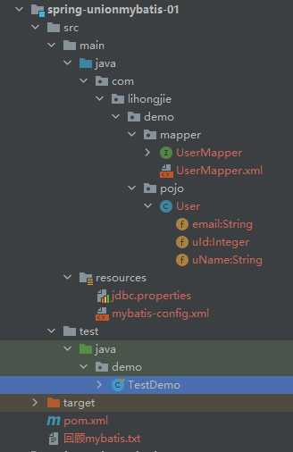
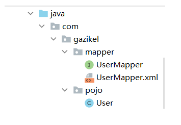

### Spring整合第三方框架

##### 1、Spring整合mybatis

* 回忆mybatis（参见demo 【spring-unionmybatis-01】）
    * mybatis官网url：https://mybatis.org/mybatis-3/zh/index.html
    * 编写实体类
      ```java
        @Data
        public class User {
            private Integer uId;
            private String uName;
            private String email;
        }
      ```

    * 编写核心配置文件
      ```xml
      <?xml version="1.0" encoding="UTF-8" ?>
      <!DOCTYPE configuration
              PUBLIC "-//mybatis.org//DTD Config 3.0//EN"
              "http://mybatis.org/dtd/mybatis-3-config.dtd">
      <configuration>
          <properties resource="jdbc.properties" />
          <typeAliases>
              <package name="com.lihongjie.demo.pojo"/>
          </typeAliases>
      
          <environments default="development">
              <environment id="development">
                  <transactionManager type="JDBC"/>
                  <dataSource type="POOLED">
                      <property name="driver" value="${mysql.driver}"/>
                      <property name="url" value="${mysql.url}"/>
                      <property name="username" value="${mysql.username}"/>
                      <property name="password" value="${mysql.password}"/>
                  </dataSource>
              </environment>
          </environments>
          <mappers>
              <mapper class="com.lihongjie.demo.mapper.UserMapper"/>
          </mappers>
      </configuration>
      ```

    * 编写接口
      ```java
        public interface UserMapper {
          public List<User> selectUser();
        }
      ```

    * 编写Mapper.xml
      ```xml
      <?xml version="1.0" encoding="UTF-8" ?>
      <!DOCTYPE mapper
              PUBLIC "-//mybatis.org//DTD Mapper 3.0//EN"
              "http://mybatis.org/dtd/mybatis-3-mapper.dtd">
      <mapper namespace="com.lihongjie.demo.mapper.UserMapper">
          <select id="selectUser" resultType="user">
              select * from learnmybatis.user
          </select>
      </mapper>
      ```

    * 测试
    ```java
    public class TestDemo {
         @Test
         public void testMybatis() throws IOException {
             SqlSessionFactory sqlSessionFactory = new SqlSessionFactoryBuilder().build(Resources.getResourceAsReader("mybatis-config.xml"));
             //需要mybatis自动提交事务，就openSession(true)
             SqlSession sqlSession = sqlSessionFactory.openSession(true);
             UserMapper userMapper = sqlSession.getMapper(UserMapper.class);
             List<User> users = userMapper.selectUser();
         }
    }
    ```

    * 项目层级结构

  

* Spring整合mybatis的三种方式：
    * mybatis-spring整合官网：https://mybatis.org/spring/zh/
    * 注意：下面说的三种方式，用的数据源都是Spring-Jdbc提供的DriverManagerDataSource, 也可以使用别的数据源替代（c3p0，dbcp，druid等等）
    * 关于maven项目的静态资源过滤（当我们使用mybatis时，*Mapper接口和*Mapper.xml文件放在同一个包下），构建项目， 可能会出现*Mapper.xml没有被构建到target目录里面去。

      
        * 解决方案（注意：**/*.xml 指定路径下的任意层级的任意xml文件都会被导出）：
      ```xml
          <build>
            <resources>
                <resource>
                    <directory>src/main/java</directory>
                    <includes>
                        <include>**/*.properties</include>
                        <!--代表src/main/java下任意层级的.xml文件会被导出-->
                        <include>**/*.xml</include>
                        <!--匹配src/main/java/*/*.xml-->
                        <!--<include>*/*.xml</include>-->
                        <!--匹配src/main/java/*.xml-->
                        <!--<include>/*.xml</include>-->
                    </includes>
                    <filtering>false</filtering>
                </resource>
            </resources>
        </build>
      ```
    * 注意：Spring整合了Mybatis之后，其实mybatis-config.xml这个全局文件都是可以摘掉了，全部配置在sqlSessionFactory的属性 中即可。但是我们一般还是会保留
      mybatis-config.xml，并且在其中配置别名管理<typeAliases>和设置<settings>。（证明程序是使用了mybatis的）
      ```xml
      <bean id="sqlSessionFactory" class="org.mybatis.spring.SqlSessionFactoryBean">
          <property name="dataSource" ref="dataSource" />
          <!-- 扫描mybatis-config.xml核心配置文件 -->
          <property name="configLocation" value="classpath:mybatis-config.xml"/>
          <!-- 扫描*mapper.xml配置文件，当然扫描了mybatis-config.xml之后，这部分还是可以写在mybatis的配置文件中-->
          <property name="mapperLocations" value="classpath:com/lihongjie/demo/mapper/*.xml"/>
      </bean>
      ```

    * 第一种整合方式：（注册sqlSessionFactory + 使用MapperFactoryBean/<mybatis:scan base-package="com.lihongjie.demo.mapper"/>）
        * 参见demo【spring-unionmybatis-02 -> spring-dao-way1.xml】
        * Spring的xml配置
        ```xml
      <?xml version="1.0" encoding="UTF-8"?>
        <beans>
            <!-- 引入properties文件 -->
            <context:property-placeholder location="classpath:jdbc.properties"/>
            <!-- 使用Spring-Jdbc提供的数据源 -->
            <bean id="dataSource" class="org.springframework.jdbc.datasource.DriverManagerDataSource">
                <property name="driverClassName" value="${mysql.driver}"/>
                <property name="url" value="${mysql.url}"/>
                <property name="username" value="${mysql.username}"/>
                <property name="password" value="${mysql.password}"/>
            </bean>
        
            <!-- 注入sqlSessionFactory-->
            <bean id="sqlSessionFactory" class="org.mybatis.spring.SqlSessionFactoryBean">
                <property name="dataSource" ref="dataSource" />
                <!-- 扫描mybatis-config.xml核心配置文件 -->
                <property name="configLocation" value="classpath:mybatis-config.xml"/>
                <!-- 扫描*mapper.xml配置文件，当然扫描了mybatis-config.xml之后，这部分还是可以写在mybatis的配置文件中-->
                <property name="mapperLocations" value="classpath:com/lihongjie/demo/mapper/*.xml"/>
            </bean>
        
            <!-- 配置数据库层操作bean，mapperInterface属性无法配置多个，若配置多个会形成覆盖 -->
            <!--<bean id="userMapper" class="org.mybatis.spring.mapper.MapperFactoryBean">
                <property name="mapperInterface" value="com.lihongjie.demo.mapper.UserMapper" />
                <property name="sqlSessionFactory" ref="sqlSessionFactory" />
            </bean>-->
            <!-- 类似于spring中的<context:component-scan>,用于扫描mybatis映射mapper接口和映射文件，会扫描指定包下的所有接口，
            扫描到springIOC容器中，如果未指定名称则是类名小写。-->
            <mybatis:scan base-package="com.lihongjie.demo.mapper"/>
        </beans>
        ```

        * mybatis的xml配置：
        ```xml
      <?xml version="1.0" encoding="UTF-8" ?>
        <!DOCTYPE configuration
                PUBLIC "-//mybatis.org//DTD Config 3.0//EN"
                "http://mybatis.org/dtd/mybatis-3-config.dtd">
        <configuration>
            <settings>
                <setting name="logImpl" value="LOG4J"/>
            </settings>
        
            <typeAliases>
                <package name="com.lihongjie.demo.pojo"/>
            </typeAliases>
            <mappers>
                <!--<mapper class="com.lihongjie.demo.mapper.UserMapper"/>-->
                <package name="com.lihongjie.demo.mapper" />
                <package name="com.lihongjie.demo.mapper2" />
            </mappers>
        </configuration>
        ```

        * *mapper接口和*mapper.xml文件照旧
        * 测试代码：
        ```java
          public class TestDemo {
            @Test
            public void testSpringUnionMybatis1(){
                ApplicationContext context = new ClassPathXmlApplicationContext("spring-dao-way1.xml");
                UserMapper userMapper = context.getBean(UserMapper.class);
                System.out.println(userMapper.getClass());
                List<User> users = userMapper.selectUser();
            }
          }
        ```
        * 优缺点：该方式省略配置sqlSessionTemplate，配置的MapperFactoryBean 将会负责 SqlSession 的创建和关闭。
          如果使用了Spring的事务功能，那么当事务完成时，session将会被提交或回滚。最终任何异常都会被转换成Spring的DataAccessException异常。

        * 若配置：<mybatis:scan base-package="com.lihongjie.demo.mapper"/>，类似于Spring的<context:component-scan base-package=""
          />
          但是该注解只会去扫描配置包下的所有mapper接口以及对应的*mapper.xml文件。且帮其生成接口名（如userMapper）小写的bean注入到Spring中。
          该bean（如userMapper），可以直接用于数据库操作（因为给UserMapper接口生成了代理）如：userMapper.selectUser();

    * 第二种整合方式（配置sqlSessionFactory + sqlSessionTemplate + 新增实现类UserMapperImpl（把sqlSessionTemplate传递进去））：
        * 参见demo【spring-unionmybatis-02 -> spring-dao-way2.xml】 from bilibili kuangshen
        * Spring的xml配置：
        ```xml
       <beans>
            <!-- 引入jdbc配置文件 -->
            <context:property-placeholder location="classpath:jdbc.properties"/>
        
            <!-- 使用Spring-Jdbc提供的数据源 -->
            <bean id="dataSource" class="org.springframework.jdbc.datasource.DriverManagerDataSource">
                <property name="driverClassName" value="${mysql.driver}"/>
                <property name="url" value="${mysql.url}"/>
                <property name="username" value="${mysql.username}"/>
                <property name="password" value="${mysql.password}"/>
            </bean>
        
            <!-- 注入sqlSessionFactory-->
            <bean id="sqlSessionFactory" class="org.mybatis.spring.SqlSessionFactoryBean">
                <property name="dataSource" ref="dataSource" />
                <!-- 扫描mybatis-config.xml核心配置文件 -->
                <property name="configLocation" value="classpath:mybatis-config.xml"/>
                <!-- 扫描*mapper.xml配置文件，当然扫描了mybatis-config.xml之后，这部分还是可以写在mybatis的配置文件中-->
                <property name="mapperLocations" value="classpath:com/lihongjie/demo/mapper/*.xml"/>
            </bean>
        
            <bean id="sqlSession" class="org.mybatis.spring.SqlSessionTemplate">
                <constructor-arg index="0" ref="sqlSessionFactory"/>
            </bean>
      
            <bean id="userMapper" class="com.lihongjie.demo.mapper.UserMapperImpl">
                <property name="sqlSession" ref="sqlSession"></property>
            </bean>
        </beans>
        ```

        * UserMapperImpl的实现：
       ```java
        public class UserMapperImpl implements UserMapper{
        private SqlSessionTemplate sqlSession;
      
        public SqlSessionTemplate getSqlSession() {
            return sqlSession;
        }
      
        public void setSqlSession(SqlSessionTemplate sqlSession) {
            this.sqlSession = sqlSession;
        }
      
        @Override
        public List<User> selectUser() {
            UserMapper userMapper = this.getUserMapper();
            return userMapper.selectUser();
        }
      
        private UserMapper getUserMapper(){
            return sqlSession.getMapper(UserMapper.class);
        }
      }
       ```  
        * mybatis-config.xml以及*Mapper.xml不再赘述（照旧）

    * 第三种整合方式（配置sqlSessionFactory + UserMapperImpl2 继承 SqlSessionDaoSupport）
        * 参见demo 【spring-unionmybatis-02 -> spring-dao-way3.xml】
        * Spring的xml配置(该案例使用了自动注入)：
        ```xml
        <beans>
            <context:property-placeholder location="classpath:jdbc.properties"/>
            <!-- spring整合mybatis，方式3，继承SqlSessionDaoSupport-->
            <bean id="dataSource" class="org.springframework.jdbc.datasource.DriverManagerDataSource">
                <property name="driverClassName" value="${mysql.driver}"></property>
                <property name="url" value="${mysql.url}"></property>
                <property name="username" value="${mysql.username}"></property>
                <property name="password" value="${mysql.password}"></property>
            </bean>
        
            <bean id="sqlSessionFactory" class="org.mybatis.spring.SqlSessionFactoryBean" autowire="byName">
                <property name="configLocation" value="classpath:mybatis-config.xml"></property>
                <!--<property name="dataSource" ref="dataSource" />-->
            </bean>
        
            <bean id="userMapper" class="com.lihongjie.demo.mapper2.UserMapperImpl2" autowire="byType">
                <!--<property name="sqlSessionFactory" ref="sqlSessionFactory"></property>-->
            </bean>
        </beans>
        ```

        * UserMapperImpl2 实现：
       ```java
        public class UserMapperImpl2 extends SqlSessionDaoSupport implements UserMapper2 {
            @Override
            public List<User> selectUser() {
                SqlSession sqlSession = this.getSqlSession();
                UserMapper2 userMapper2 = sqlSession.getMapper(UserMapper2.class);
                return userMapper2.selectUser();
            }
        } 
       ```

##### 2、log4j样例文件(整合mybatis时使用)：

* 重要：log4j.logger.com.lihongjie.demo.mapper=DEBUG
    ```properties
    # set log levels   Appender-->中文翻译：输出目的地、输出源
    # 日志输出级别，appenderName1，appenderName2.....
    log4j.rootLogger = debug, consoleOut   
    #log4j.rootLogger.com.lihongjie.demo.mapper = debug
    # 指定mapper配置文件所在包的日志输出级别（用这种方式提高无用日志的输出门槛）
    log4j.logger.com.lihongjie.demo.mapper=DEBUG
    
    #配置日志信息输出目的地Appender
    # 输出源类型
    log4j.appender.consoleOut = org.apache.log4j.ConsoleAppender 
    log4j.appender.consoleOut.Target = System.out
    # 输出源样式
    log4j.appender.consoleOut.layout = org.apache.log4j.PatternLayout
    log4j.appender.consoleOut.layout.ConversionPattern = %d{ABSOLUTE} %5p %c:%L - %m%n
    ```

##### 3、Spring整合log4j

* 参考博客：https://yuhongliang.blog.csdn.net/article/details/109407627
* 指定具体包的日志输出级别：log4j.logger.com.lihongjie=DEBUG  
* 详细步骤
    * 引入log4j的pom依赖【注意：Spring的版本不同，那么引入的具体依赖就不同】
    ```xml
  <?xml version="1.0" encoding="UTF-8"?>
    <dependencies>
        <dependency>
           <groupId>org.slf4j</groupId>
             <artifactId>slf4j-log4j12</artifactId>
             <version>1.7.25</version>
        </dependency>
    
        <dependency>
            <groupId>log4j</groupId>
            <artifactId>log4j</artifactId>
            <version>1.2.17</version>
        </dependency>
    </dependencies>
    ```
  
    * 创建配置log4j.properties文件
    ```properties
    # resources文件夹根目录下
    ### 配置根
    log4j.rootLogger = debug,console
    
    ### 日志输出到控制台显示
    log4j.appender.console=org.apache.log4j.ConsoleAppender
    log4j.appender.console.Target=System.out
    log4j.appender.console.layout=org.apache.log4j.PatternLayout
    log4j.appender.console.layout.ConversionPattern=%d{yyyy-MM-dd HH:mm:ss} %-5p %c{1}:%L - %m%n
    ```
    
    